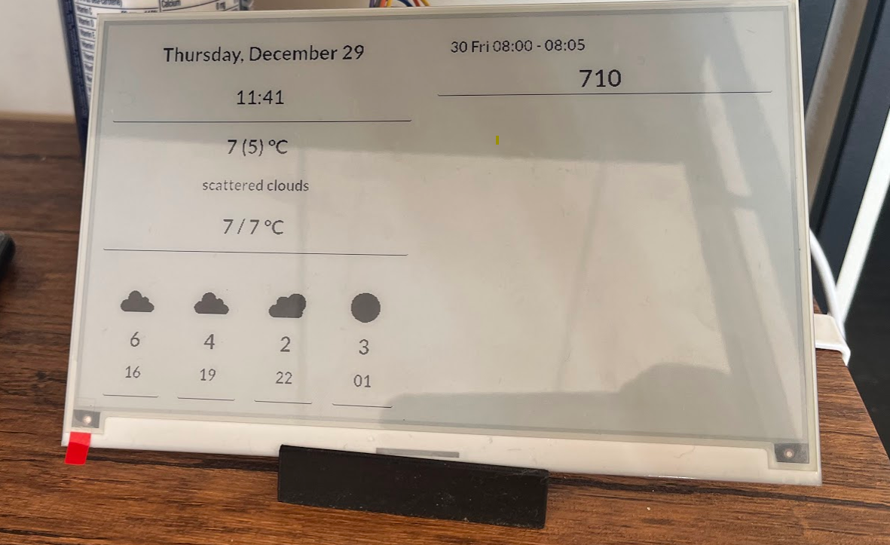

# dash-board
Personal dashboard running on Raspberry Pi and displaying on Waveshare 7.5" E-ink display 

# How to 
TODO: Update more instructions here

- Install dependent packages 
- Update env information 
- run the following commands 
