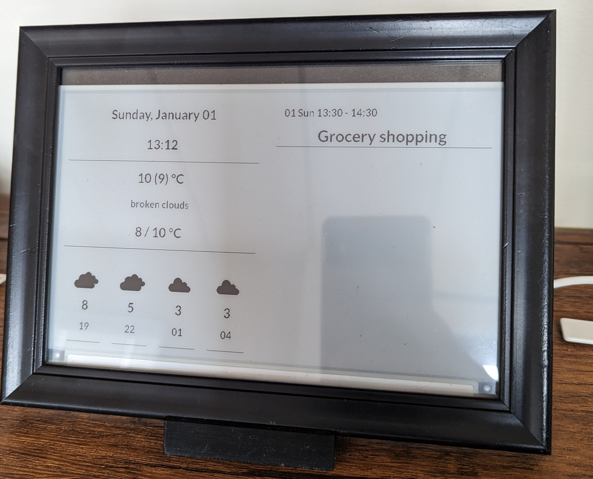
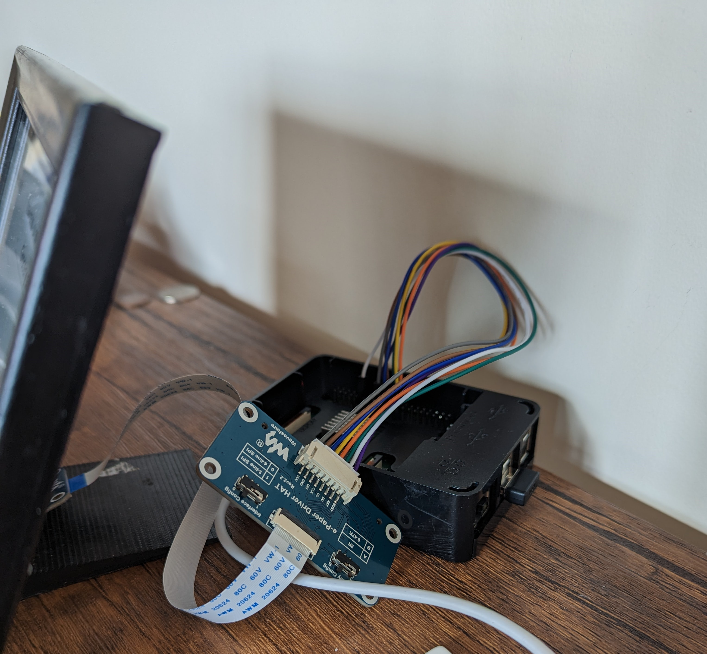
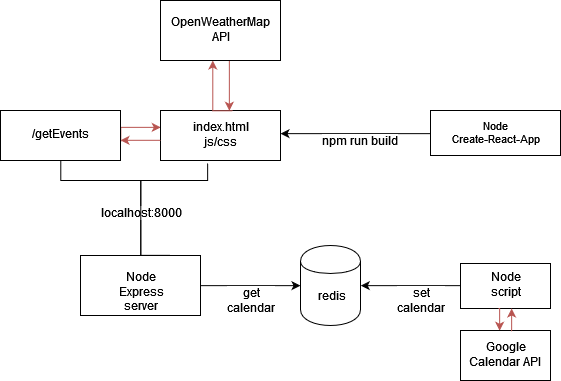

# dash-board
Personal dashboard running on Raspberry Pi and displaying on Waveshare 7.5" E-ink display 

# Pieces used in this project
- Raspberry Pi
- Waveshare 7.5" V2 display
- OpenWeatherMap API Key
- Google OAuth credentials with Google calendar enabled

# How to 
## Using node standalone
1. Install dependent packages - `npm install`
2. Install redis
3. Copy `.env` from `.env.default` and populate it with your configurations
4. Create `backbone/creds/credentials.json` and populate it with credential from Google API Oauth profile
5. Run `backbone/fetchAndStore.js` with GUI and proceed with Oauth (need to sign in with Google). This step is only required once
6. Set up cronjob to run `npm run fetch` (or `node backbone/fetchAndStore.js`) at set intervals. This will ensure redis will get updated calendar information. Calendar events are stored in `calendar` key
7. Build frontend by running `npm run build`
8. Run express server by running `npm run host` (in the background if you want to keep it running)
9. Visit `localhost:<YOUR_PORT_FROM_ENV>` and check the dashboard in action
10. Install [ejs](https://github.com/samsonmking/epaper.js?ref=codebldr)
11. Run `ejs refresh -i 300 rpi-7in5-v2 "http://localhost:8000"` (recommend using screen to run ejs in the background)

## Using Docker 
1. Run `docker compose up -d`
2. Set up cronjob to periodically run `npm run fetch` as mentioned earlier
3. Run `ejs refresh -i 300 rpi-7in5-v2 "http://localhost:8000` (recommend using screen to run ejs in the background)

# Architecture

